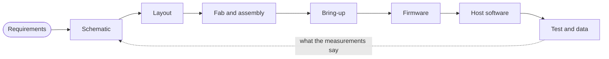
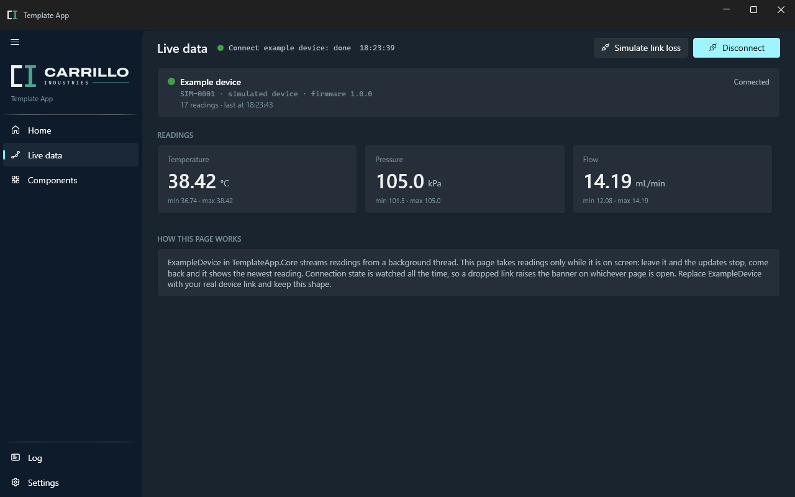

  <picture>
    <source media="(prefers-color-scheme: dark)" srcset="assets/carrillo-industries-dark.png">
    
  </picture>

  <b>Circuit boards, the firmware that runs on them, and the software that talks to both.</b> 
  <a href="https://carrilloindustries.com">CarrilloIndustries.com</a>

I'm an embedded systems engineer working in R&D. I take an instrument from the first block diagram through schematic, layout, bring-up and firmware to the desktop tool that drives it on the bench, and back again when the measurements say something should change. This account is where I share the parts of that work worth reusing.

## The whole loop

## Hardware

| | |
|---|---|
| **Schematic and layout** | Multilayer boards from block diagram to fabrication and assembly files, with parts chosen for stock as well as specs. |
| **High-speed digital** | Stackup planning, controlled impedance, length and skew matching, and return paths with no breaks in them. |
| **Mixed signal** | ADC and DAC front ends, references and clocks, and grounding that keeps switching noise out of the measurement. |
| **Analog** | Amplifiers, filters, sensor conditioning and current sensing. |
| **Low-speed and power** | Microcontroller systems, sensor and bus interfaces, regulators, sequencing and protection. |
| **Build and bring-up** | Assembly, rework, and first power-up with a scope and a current-limited supply. |

## Firmware and software

| | |
|---|---|
| **Firmware** | C on STM32 and other Arm Cortex-M parts: interrupt- and DMA-driven drivers, timers and ADCs, and framed binary protocols with CRC checks over USB, UART and RS-485. |
| **Host tools** | C# and .NET desktop apps that connect to the hardware, log every exchange, and stay responsive while the device streams data. |
| **Automation** | Python for test scripts, instrument control over SCPI, data analysis and plots, and BOM pricing across distributors. |

  

## How I work

- **Measure first.** A claim about speed or noise comes with a number, and a fix comes with the measurement that proved it.
- **Write down the root cause.** Every hard problem gets a short record: the symptom, the real cause, the fix, and what keeps it from coming back.
- **Record decisions.** Design choices are written down with the alternatives and why they lost.
- **Version everything.** Every release gets a version number and a changelog entry.
- **Document while building.** Docs are written alongside the work, while the reasons are still fresh.

## Open source

I'd rather publish a useful tool than leave it in a drawer. Take what helps.

| Project | What it does | Status |
|---|---|---|
| **carrillo-wpf-template** | A .NET 10 WPF starting point for hardware tools: navigation shell, MVVM, dependency injection, per-session logs, settings and tests. One `dotnet new` command creates a new app from it. | Preparing for release |
| **Automate-BOM** | Looks up live stock and pricing for a bill of materials across DigiKey, Mouser and Newark, and writes a priced Excel workbook. | Preparing for release |

## Get in touch

Open an issue or start a discussion on any of my repositories. Questions, bug reports and pull requests are all welcome.
